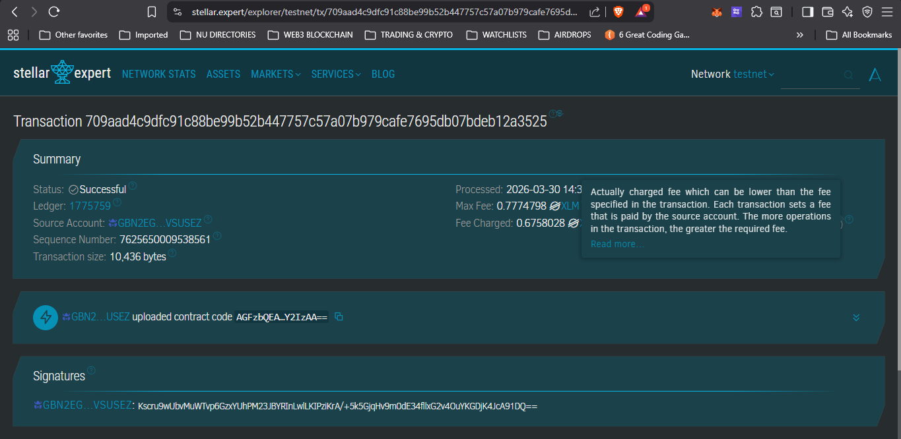

# ClaimChain PH

**Instant insurance claims on Stellar — eliminating paperwork, agent dependency, and week-long delays**

---

## Details

ClaimChain PH is a blockchain-based insurance claims platform built on the Stellar network. It transforms the traditional insurance claims process by leveraging Soroban smart contracts to create a transparent, efficient, and trustless system for policy registration, premium tracking, and instant claim payouts.

The platform enables:
- **On-chain policy registration** with unique policy IDs (hash + owner wallet)
- **Automated premium tracking** and expiry date management
- **Document hash verification** for claim submissions
- **Instant USDC payouts** to verified wallets upon claim approval
- **Automatic expiry alerts** for policies nearing their end date

---

## Problem

A 28-year-old working professional in Manila with a 5-year term life insurance policy faces a medical emergency but cannot file a claim quickly because:

- **Paper forms take 2-3 weeks to process**
- **Her insurance agent left the company**, leaving her without support
- **No clear proof** of premium payment history or policy expiry date
- **Result:** ₱50,000 in out-of-pocket hospital bills while waiting for claim approval

This scenario reflects a **₱180 billion Philippine insurance market** where 97% of claims are still paper-based, leaving millions of Filipinos vulnerable during their most critical moments.

---

## Solution

ClaimChain PH uses **Stellar's Soroban smart contracts** to:

1. **Register policies on-chain** — Each policy is stored with a unique hash, owner wallet, coverage amount, and expiry date
2. **Track premium payments automatically** — Smart contracts verify payment status and activate policies
3. **Enable instant claim submission** — Policyholders submit claims with document hash verification (hospital bills, receipts)
4. **Trigger immediate payouts** — Upon admin approval, USDC is transferred instantly to the policyholder's wallet

**Key Benefits:**
- ✅ No paperwork required
- ✅ No agent dependency
- ✅ No week-long delays
- ✅ Transparent, immutable records
- ✅ 24/7 claim submission capability

---

## Technical Stack

| Component | Technology |
|-----------|------------|
| **Blockchain** | Stellar Network (Testnet) |
| **Smart Contracts** | Soroban (Rust-based) |
| **Payment Token** | USDC (for claim payouts) |
| **Premium Currency** | XLM (for premium payments) |
| **Contract Language** | Rust (no_std) |
| **Build Target** | WebAssembly (wasm32-unknown-unknown) |
| **CLI Tools** | Soroban CLI v21.5.0+ |

### Core Smart Contract Functions

| Function | Description |
|----------|-------------|
| `initialize()` | Set admin address for claim approvals |
| `register_policy()` | Register new policy on-chain with coverage details |
| `pay_premium()` | Activate policy after premium payment |
| `submit_claim()` | Submit claim with document hash verification |
| `approve_claim()` | Admin approves pending claims |
| `verify_policy()` | Check if policy is active |
| `check_expiry_alert()` | Alert if policy expires within 30 days |
| `get_policy()` | Retrieve policy details |
| `get_claim()` | Retrieve claim details |

---

## Smart Contract Deployment Proof

**Transaction Hash:** `709aad4c9dfc91c88be99b52b447757c57a07b979cafe7695db07bdeb12a3525`

**Stellar Expert Explorer:** [View Transaction](https://stellar.expert/explorer/testnet/tx/709aad4c9dfc91c88be99b52b447757c57a07b979cafe7695db07bdeb12a3525)

### Transaction Screenshot

---

**Built with ❤️ on Stellar**